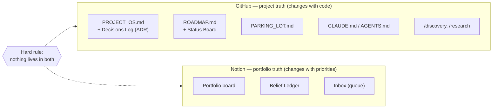
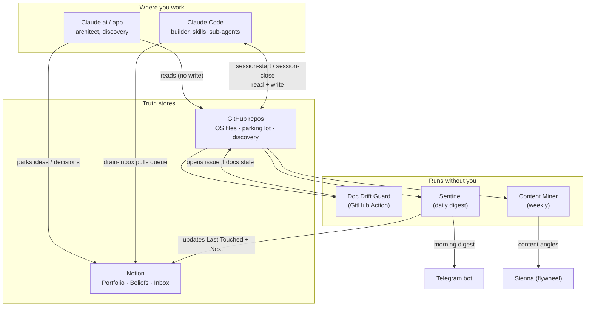
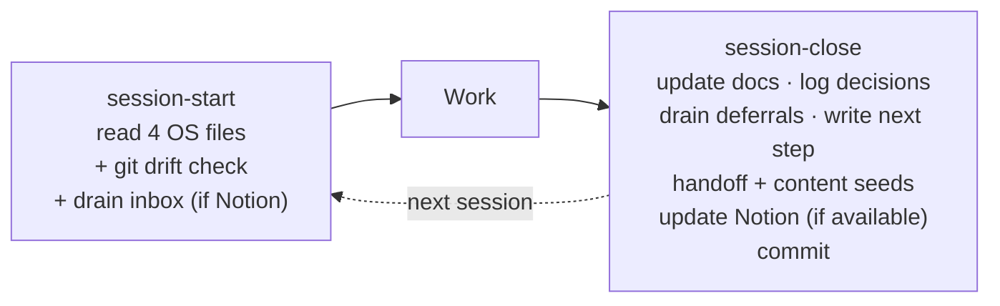

# PMAWS — Project Management Agentic Workflow System

**Purpose:** A personal operating system for managing, organizing, and learning from many AI-built projects at once — without drowning in scaffolding, drift, or half-finished ideas.
**Owner:** Snow · **Status:** Live (core loop operational) · **Last updated:** 2026-07-16

> This document is itself the PROJECT_OS for PMAWS. It is written in the same house format the system enforces on every other repo.

---

## 1. Problem

The system exists to fix a specific, recurring set of failures observed across a portfolio of AI-assisted projects. None of these are exotic; together they quietly destroy operational efficiency.

- **Scaffolding is reinvented every project.** The same PROJECT_OS / ROADMAP / PARKING_LOT files get rebuilt by hand each time, in slightly different formats.
- **The idea funnel leaks.** Ad-hoc ideas get explored in a chat, produce a good artifact, and then the chat dies. There is no inbox, no triage, no kill decision — so ideas accumulate and nothing gets disposed of.
- **The strategist cannot see the repo.** Architecture happens in the chat interface; project truth lives in git. Every architecture session starts by re-establishing context by hand.
- **Handoffs are hand-carried and lossy.** Moving state between a planning session and a building session is improvised each time, and detail evaporates.
- **Docs drift the moment you stop looking.** Code moves; the roadmap and decision log do not. The highest-value file (the decisions log) is the one most likely to rot, because nothing forces an update.
- **The best content is buried in build artifacts.** Decisions, debugging stories, and hard-won lessons — prime build-in-public material — never get mined.
- **The last mile is where things die.** Projects reach "nearly done" and stall, because there is no forcing function to finish.
- **Project sprawl.** Roughly ten things in flight against a hard limit on weekly hours. Building a management system is itself a satisfying way to avoid shipping — so the system must force culls, not just organize.
- **The re-briefing tax.** Every fresh session resets the context window, forcing a re-explanation of the project, stack, and architecture.
- **Multiple accounts.** A second, local-only Claude Code account (no GitHub/Notion connectors) needs the same workflow without the cloud pieces.

---

## 2. Solution

A layered system with one hard rule at its center.

**The hard rule — one source of truth, split by lifecycle:**

- If it changes when **code** changes → it lives in the **repo** (GitHub).
- If it changes when **priorities** change → it lives in **Notion**.
- Nothing lives in both. When unsure, ask whether a terminal agent needs to read it; if yes, it goes in the repo.

On top of that rule sit four layers:

1. **Truth stores.** Per-repo OS files (GitHub) + a cross-project portfolio, belief ledger, and inbox (Notion).
2. **Skills** — project-agnostic procedures in `~/.claude/skills/`: `project-os`, `session-start`, `session-close`, `drain-inbox`.
3. **Agents** — things that run without you: a doc-drift guard (GitHub Action, built), a portfolio sentinel (planned), a content miner (planned), and a discovery sub-agent bench (planned).
4. **Discovery / belief gating** — a lens layer at the top of the funnel that decides *whether to build at all*, drawn from lean-startup and systems-thinking canon, and a belief ledger that lets evidence compound across projects.

What makes this more effective than off-the-shelf single-repo memory systems (e.g. the Memory Bank pattern) is the two layers those systems lack: a **cross-project portfolio** (which project deserves attention, not just what's in the current one) and **discovery/belief gating** (should this exist at all).

---

## 3. Architecture

### 3.1 The two-tier source of truth



### 3.2 Complete system



**Reading the loop:** you think in Claude.ai → it queues to the Notion Inbox → Claude Code drains the queue into the repo → the Sentinel reads the repo and refreshes the Portfolio → the Portfolio is what you review. No step requires re-explaining a project to anyone. Claude.ai reads GitHub but never writes it — there is exactly one write path into the repo (Claude Code), which is what prevents drift between what was discussed and what was committed.

### 3.3 The session loop (works on any account)



### 3.4 The discovery funnel — Stages track *evidence*, not build progress

A project's Stage reflects what has been **validated**, not how much code exists. This is why a heavily-built product can honestly sit at "Demand": the code is real but demand is unproven.

| Stage | Question it answers | Advance when… |
|-------|--------------------|---------------|
| Intake | Worth a look at all? | Survives the kill-card; has a $0 test |
| Problem | Do I understand the problem and who has it? | Problem is evidenced, not assumed |
| Demand | Will the user reach for and trust this? | Real demand signal exists |
| Build | Can I build it correctly? | Demand proven; feasibility is now the risk |
| Ship | Is it live and used? | Real users in production |
| Distribute | Does it spread? | Traction beyond your own push |

### 3.5 Component reference

| Component | Home | Status |
|-----------|------|--------|
| `project-os` skill | `~/.claude/skills/` | ✅ built |
| `session-start` skill | `~/.claude/skills/` | ✅ built |
| `session-close` skill | `~/.claude/skills/` | ✅ built |
| `drain-inbox` skill | `~/.claude/skills/` | ✅ built |
| Doc Drift Guard | central repo `.github/workflows` | ✅ written, ⏳ to deploy |
| Portfolio / Beliefs / Inbox DBs | Notion | ✅ built |
| Sentinel | cron + connectors | 💡 planned |
| Content Miner | weekly job → Sienna | 💡 planned |
| Discovery sub-agent bench | `~/.claude/agents/` | 💡 planned |

---

## 4. AI Concepts & Practices (content-flywheel feed)

Each entry below is both a design decision *and* a content seed for Sienna. The value is the **grounded take** — the opinion earned by building, not the textbook definition.

**Architecture Decision Records (ADR).** Every non-trivial decision is logged as Context / Decision / Consequence, newest first, and superseded (never deleted) when it changes. *Grounded take:* the one-line "we chose X" is useless in six months; recording *what forced the choice* is what tells you whether the decision still holds. Deleting old decisions destroys the most valuable thing — the record of why you changed your mind.

**Context engineering.** Deciding what enters the finite context window, and when. PMAWS splits it into a static half (repo files + skills, pulled on demand) and a dynamic half (session-to-session memory via handoffs). *Grounded take:* the amnesia between sessions is a feature once you externalize memory into structured files — the agent rebuilds context from disk instead of from you re-typing it.

**The Memory Bank pattern (and why leaner wins).** The four-file standard is a lean descendant of community memory-bank setups. *Grounded take:* bloated, auto-generated instruction files hurt more than they help — the important rules get buried and the agent learns to half-ignore them. Treat the skills/rules folder like dotfiles: small, hand-curated, always shrinking.

**Evidence-based stage tracking.** Stages advance on validated evidence, not lines of code. *Grounded take:* the number-one way projects die isn't bad code, it's building something nobody wanted; a Stage field that refuses to advance on code alone keeps you honest even against your own optimism.

**The belief ledger.** Projects are clusters of beliefs; the ledger stores beliefs (not ideas) with an evidence status and links each to every project that depends on it. *Grounded take:* your beliefs repeat across projects, so testing one load-bearing belief once updates the confidence of every project that leans on it. Scans compound; beliefs compound harder.

**Discovery gates as a stage function.** The canon (Lean Startup, Zero to One, The Mom Test, Inspired, The Cold Start Problem, Contagious, Hooked, Taleb, systems thinking) disagrees with itself on purpose — optionality is correct pre-evidence, commitment post-evidence. *Grounded take:* don't blend a reading list into "wisdom soup"; treat it as a stage function where each book contributes one falsifiable question with a kill condition, or it doesn't earn a place.

**The $0 / 48-hour test and the concierge test.** Every surviving idea needs a next test that costs nothing and takes two days. *Grounded take:* the reason "test it" feels impossible is the assumption the product must exist first — it doesn't. Be the product by hand where users already are (a concierge test), and you test demand and trust and harvest a golden dataset, all before writing code.

**The kill card (premortem-first).** Before building, write the failure postmortem: it's twelve months out, this failed, why? *Grounded take:* ranking the likely causes and testing the top one first does more damage to optimism bias than any checklist, because it puts the knife in your own hand.

**RAG vs fine-tuning for grounded domains.** (From Gabay's legal-info design.) *Seed topic:* why retrieval with enforced citations beats fine-tuning when every factual claim must trace to a source, and the corpus changes underneath you.

**Golden evals + LLM-as-judge.** *Seed topic:* scoring correctness, groundedness, helpfulness, and refusal-appropriateness against a curated dataset, with the judge model from a different family than the model under test — and why "if a behavior isn't covered by an eval, it isn't a supported behavior."

**Human-in-the-loop as a first-class surface.** *Seed topic:* refusals and escalations designed as warm, actionable product moments rather than error states; approval flows (e.g. Telegram) as the control interface for autonomous pipelines.

**Provider abstraction & portability.** Two-provider abstraction behind one interface; AGENTS.md as the canonical rules file with tool-specific symlinks. *Grounded take:* assume every component (LLM provider, embedding model, vector store) will change, and make the canonical file portable so the day a better tool ships, the setup moves in an afternoon instead of a rebuild.

---

## 5. Roadmap & Current Status

**Status vocabulary:** ✅ shipped · 🔄 in progress · ⏳ next · 💡 planned · 🅿️ parked

### Status Board

| Phase | What | Status | Notes |
|-------|------|--------|-------|
| 1 | Notion truth layer (Portfolio, Beliefs, Inbox) | ✅ shipped | built + populated |
| 2 | Portfolio cull (3 Active / 3 Frozen cap) | ✅ shipped | Gabay, Sienna, Workout App active |
| 3 | Repo OS-file standard (4 files, house format) | ✅ shipped | in all active repos |
| 4 | Core skills (project-os, session-start, session-close, drain-inbox) | ✅ shipped | connector-aware |
| 5 | Doc Drift Guard | 🔄 in progress | written; ⏳ deploy to repos |
| 6 | Gabay concierge $0 test | ⏳ next | THE actual next action |
| 7 | Discovery skill + LENSES.md | 💡 planned | the gate rubric |
| 8 | Sub-agent bench (redteam, landscape-scout) | 💡 planned | build after a real loop run |
| 9 | Portfolio Sentinel (daily digest + repo→Notion sync) | 💡 planned | removes CC2 manual sync |
| 10 | Content Miner → Sienna | 💡 planned | feeds the flywheel |
| — | The Frameshift Intelligence OS harvest | 🅿️ parked | frozen; preserve-then-delete pass |

### Current portfolio

| Project | Tier | Stage | Note |
|---------|------|-------|------|
| Gabay | Active | Demand | OFW legal-info product; demand unvalidated despite heavy build |
| Sienna | Active | (tbd) | the content flywheel → Substack/LinkedIn |
| Workout App | Active | (tbd) | fields to be defined |
| The Frameshift | Frozen | — | carousel generator (repurposed name) |
| The Frameshift Intelligence | Frozen | — | intelligence pipeline; OS harvest pending |
| EggCRM | Frozen | — | — |

**The standing reminder:** infrastructure is the comfortable place to hide. The system's own next action (Phase 6) is a demand test, not more building.

---

## 6. Operators Guide

### 6.1 Set up a NEW project

1. Create the repo; add it as a row in the Notion **Portfolio** (Repo URL, Tier, Stage = Intake).
2. In Claude Code, run **`project-os`** → it bootstraps the four files in house format.
3. Run the **discovery** gates before building: write the kill card, name the riskiest belief (add it to the **Belief Ledger**, link it to the project), define the **$0 test**.
4. Only advance Stage past Demand when evidence — not code — justifies it.

### 6.2 Set up an EXISTING / vibe-coded project

1. Add the Portfolio row (Repo URL, Tier).
2. `git pull` so the local clone is current.
3. In Claude Code, run **`project-os`** — it auto-detects mode:
   - No OS files → **bootstrap** from code + git history, ending in a `[GAP]` list for you to fill.
   - Files exist but inconsistent → **standardize** to house format, migrating the Decisions Log to ADR going forward (old one-line entries preserved, not rewritten).
4. Answer the `[GAP]` questions; leave true unknowns as `[GAP]`. A frozen repo is allowed holes.
5. `git push` (or push from an online account).

> If a project's history is trapped **off-repo** (a deleted skill, an old local folder, a long chat), paste that history into the standardize prompt as supplementary context. The repo's code always wins on conflict.

### 6.3 Daily user-flow (the loop)

```
git pull
[run session-start]      → reads 4 OS files, flags doc drift, drains inbox (if Notion)
  ... work ...
[run session-close]      → updates docs, logs ADR decisions, drains deferrals to
                           parking lot, writes the EXACT next step, emits handoff +
                           content seeds, updates Notion (if available), commits
git push
```

- **session-start** hands you the one `⏳ next` action. It's a strong suggestion, not a command.
- **session-close** is the forcing function. Run it *every* session, even small ones — the habit is the value.
- Never advance a Stage because code grew. Evidence advances stages.

### 6.4 Cross-account flow (CC2, local-only)

CC2 has no GitHub/Notion connectors. Install the same skills (drain-inbox is harmless; it just won't fire).

- **session-start** reads local OS files (no pull-from-GitHub needed — truth is on disk).
- **session-close** commits locally and prints a `PORTFOLIO UPDATE` block instead of writing Notion, and says "committed locally, NOT pushed."
- **You** push from an online account; Notion catches up manually (paste the block) or later via the Sentinel.
- **Git hygiene is the one discipline:** `git pull` before, `git push` after. The skills are only as correct as the clone they read.

### 6.5 Weekly review & the cull (Mission Control, ~30 min)

- Enforce the **3-Active cap**. If a fourth wants Active, something leaves.
- Kill one thing; promote one idea (promotion requires a smallest-viable-slice and a kill-by date).
- Pick the week's one publishable artifact for Sienna.
- Review the Belief Ledger: any **Fatal + leap-of-faith** belief, sorted by how many projects depend on it, is your research agenda.

### 6.6 Retiring a deprecated skill or project

1. **Harvest first.** Move any real history (decisions, build phases, parked items) out of the artifact and into the correct repo files via `project-os` standardize mode.
2. **Check for orphaned local state** before deleting anything.
3. **Then delete.** A skill you haven't triggered in 30 days is a candidate for removal.

---

## Appendix — Quick reference

**Repo file standard (every project):**
- `PROJECT_OS.md` — purpose, stack, architecture-as-is, key decisions, constraints, ADR Decisions Log
- `ROADMAP.md` — Status Board (emoji vocabulary) + phase detail
- `PARKING_LOT.md` — deferred features/bugs/ideas, one line each, dated
- `CLAUDE.md` → symlink to `AGENTS.md` (canonical, lean)

**House format:** role tags `[HU]` / `[AI]` / `[INFERRED]`; inline file citations `(file.ext)`; no em dashes; decisions in ADR format (Context / Decision / Consequence, supersede-don't-delete).

**Notion databases:** Portfolio · Belief Ledger · Inbox (queue with `Target project` relation + `Drained` checkbox).

**Skills:** `project-os` (bootstrap/standardize) · `session-start` (rehydrate) · `session-close` (capture) · `drain-inbox` (queue → repo).

**Design principles, condensed:**
- One source of truth, split by lifecycle. Nothing lives in both places.
- One write path into the repo (Claude Code). The architect reads, never writes.
- Stages track evidence, not code.
- Beliefs compound across projects; test once, update everywhere.
- Every idea needs a $0 / 48-hour next test.
- Infrastructure is where shipping goes to hide. Prefer the demand test.
